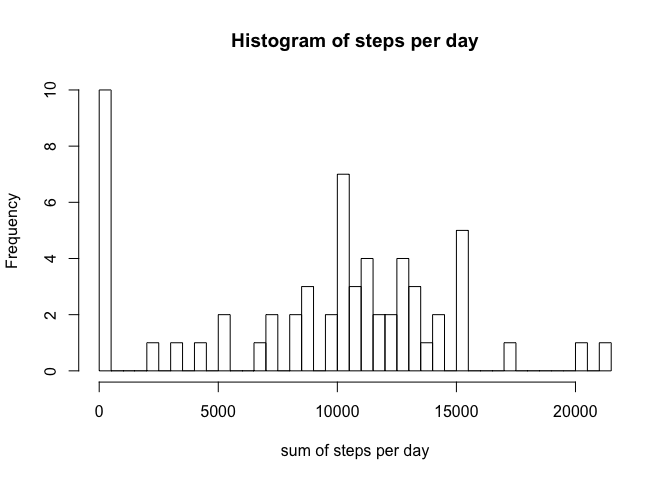
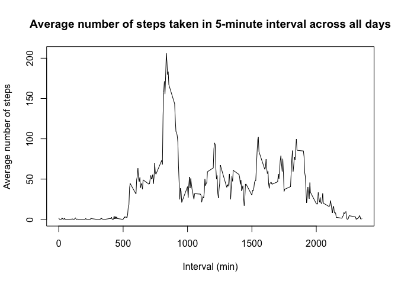
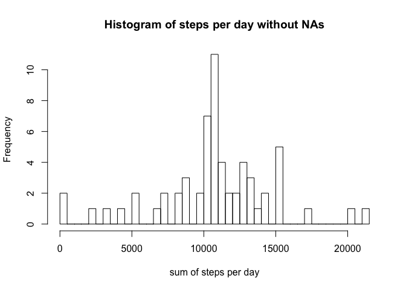
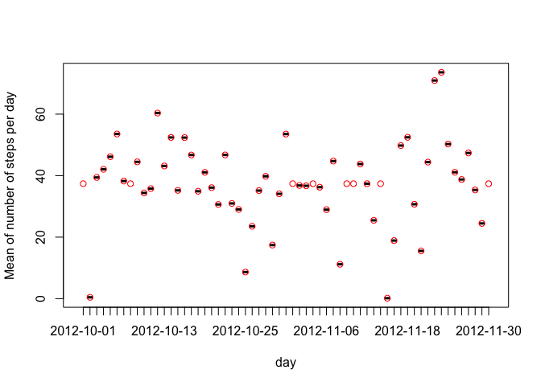
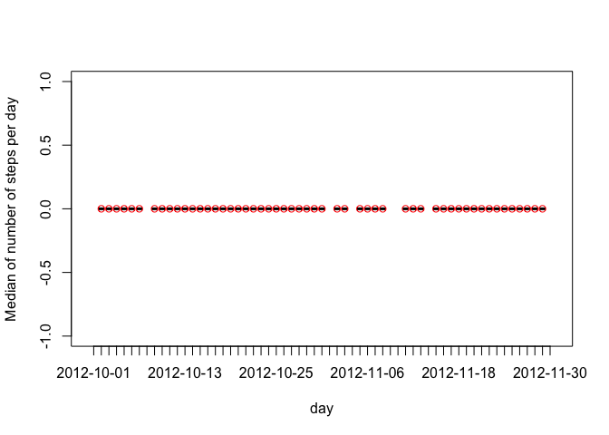
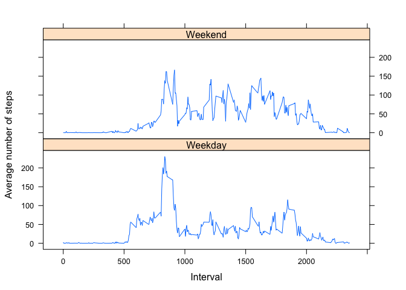

# Reproducible Research: Peer Assessment 1


## Loading and preprocessing the data


```r
activity<-read.csv("activity.csv")   
head(activity)   
```

```
##   steps       date interval
## 1    NA 2012-10-01        0
## 2    NA 2012-10-01        5
## 3    NA 2012-10-01       10
## 4    NA 2012-10-01       15
## 5    NA 2012-10-01       20
## 6    NA 2012-10-01       25
```

```r
str(activity)  
```

```
## 'data.frame':	17568 obs. of  3 variables:
##  $ steps   : int  NA NA NA NA NA NA NA NA NA NA ...
##  $ date    : Factor w/ 61 levels "2012-10-01","2012-10-02",..: 1 1 1 1 1 1 1 1 1 1 ...
##  $ interval: int  0 5 10 15 20 25 30 35 40 45 ...
```

```r
library(dplyr)  
```

```
## 
## Attaching package: 'dplyr'
```

```
## The following objects are masked from 'package:stats':
## 
##     filter, lag
```

```
## The following objects are masked from 'package:base':
## 
##     intersect, setdiff, setequal, union
```


## What is mean total number of steps taken per day?
Sum of number of steps taken each day  

```r
groupStepsDay<-group_by(activity, date)
sumStepsDay<-summarize(groupStepsDay, sum(steps, na.rm = TRUE))
head(sumStepsDay)
```

```
## # A tibble: 6 × 2
##         date `sum(steps, na.rm = TRUE)`
##       <fctr>                      <int>
## 1 2012-10-01                          0
## 2 2012-10-02                        126
## 3 2012-10-03                      11352
## 4 2012-10-04                      12116
## 5 2012-10-05                      13294
## 6 2012-10-06                      15420
```

```r
hist(sumStepsDay$`sum(steps, na.rm = TRUE)`, breaks = 61, xlab = "sum of steps per day", 
main = "Histogram of steps per day")
```

<!-- -->
Mean number of steps taken each day  

```r
averageStepsDay<-summarize(groupStepsDay, mean(steps, na.rm = TRUE))
print(averageStepsDay)
```

```
## # A tibble: 61 × 2
##          date `mean(steps, na.rm = TRUE)`
##        <fctr>                       <dbl>
## 1  2012-10-01                         NaN
## 2  2012-10-02                     0.43750
## 3  2012-10-03                    39.41667
## 4  2012-10-04                    42.06944
## 5  2012-10-05                    46.15972
## 6  2012-10-06                    53.54167
## 7  2012-10-07                    38.24653
## 8  2012-10-08                         NaN
## 9  2012-10-09                    44.48264
## 10 2012-10-10                    34.37500
## # ... with 51 more rows
```
Median number of steps taken each day  

```r
medianStepsDay<-summarize(groupStepsDay, median(steps, na.rm = TRUE))
print(medianStepsDay)
```

```
## # A tibble: 61 × 2
##          date `median(steps, na.rm = TRUE)`
##        <fctr>                         <dbl>
## 1  2012-10-01                            NA
## 2  2012-10-02                             0
## 3  2012-10-03                             0
## 4  2012-10-04                             0
## 5  2012-10-05                             0
## 6  2012-10-06                             0
## 7  2012-10-07                             0
## 8  2012-10-08                            NA
## 9  2012-10-09                             0
## 10 2012-10-10                             0
## # ... with 51 more rows
```


## What is the average daily activity pattern?
1. Plot of the 5-minute interval (x-axis) and the average number of steps taken, averaged across all days (y-axis) 


```r
intervalGroup<-group_by(activity, interval)
intervalAverageSteps<-summarize(intervalGroup, mean(steps, na.rm = TRUE))

with(intervalAverageSteps, plot(interval, intervalAverageSteps$`mean(steps, na.rm = TRUE)`, 
type = "l", xlab = "Interval (min)", ylab = "Average number of steps", 
main = "Average number of steps taken in 5-minute interval across all days"))
```

<!-- -->

2. Which 5-minute interval, on average across all the days in the dataset, contains the maximum number of steps?  


```r
intervalAverageSteps$interval[which.max(intervalAverageSteps$`mean(steps, na.rm = TRUE)`)]
```

```
## [1] 835
```


## Imputing missing values
1.Calculate and report the total number of missing values in the dataset (i.e. the total number of rows with 𝙽𝙰s)  


```r
totalNA<-sum(is.na(activity$steps))
mean(is.na(activity$steps))
```

```
## [1] 0.1311475
```

2-3.Filling in all of the missing values in the dataset with the mean for the same 5-minute interval  


```r
meanIntervalSteps<-intervalAverageSteps$`mean(steps, na.rm = TRUE)`
passi<-vector()
for(i in 1:17568) {
     if(is.na(activity$steps[i])){
         x<-activity$interval[i]
         
         for(j in 1:288){
             if (identical(x, intervalAverageSteps$interval[j])){
                 passi[i]<-meanIntervalSteps[j]
             }
         }
     }
     else {
         passi[i]<-activity$steps[i]
     }
     
}

activityWithoutNA<-mutate(activity, steps=passi)
head(activityWithoutNA)
```

```
##       steps       date interval
## 1 1.7169811 2012-10-01        0
## 2 0.3396226 2012-10-01        5
## 3 0.1320755 2012-10-01       10
## 4 0.1509434 2012-10-01       15
## 5 0.0754717 2012-10-01       20
## 6 2.0943396 2012-10-01       25
```

4.Histogram of the new dataset  


```r
correctGroupStepsDay<-group_by(activityWithoutNA, date)
correctSumStepsDay<-summarize(correctGroupStepsDay, sum(steps))

hist(correctSumStepsDay$`sum(steps)`, breaks = 61, xlab = "sum of steps per day", 
main = "Histogram of steps per day without NAs")
```

<!-- -->

```r
correctAverageStepsDay<-summarize(correctGroupStepsDay, mean(steps))
correctMedianStepsDay<-summarize(correctGroupStepsDay, median(steps))


with(averageStepsDay, plot(averageStepsDay$date, averageStepsDay$`mean(steps, na.rm = TRUE)`, 
pch=19, col="black", xlab="day", ylab="Mean of number of steps per day"))
points(correctAverageStepsDay$date, correctAverageStepsDay$`mean(steps)`, col="red")
```

<!-- -->

```r
with(medianStepsDay, plot(medianStepsDay$date, medianStepsDay$`median(steps, na.rm = TRUE)`, 
pch=19, col="black", xlab="day", ylab="Median of number of steps per day"))
points(correctMedianStepsDay$date, correctMedianStepsDay$`median(steps)`, col="red")
```

<!-- -->


## Are there differences in activity patterns between weekdays and weekends?

<!-- -->
